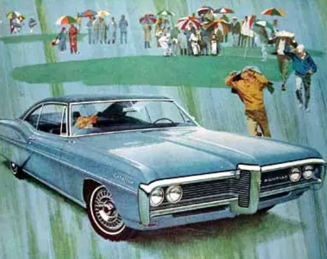
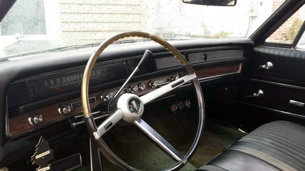
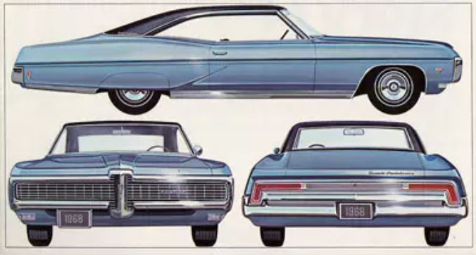
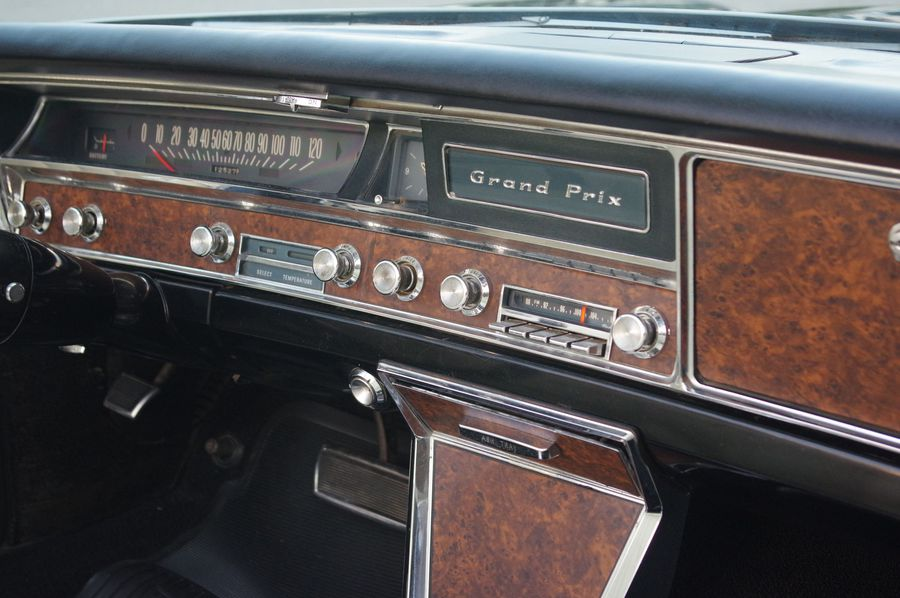
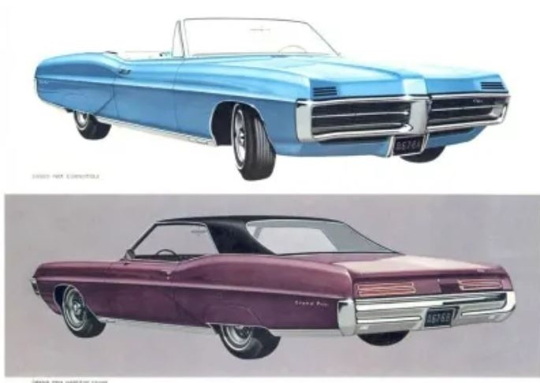
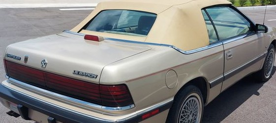

<strong>Test Your Knowledge</strong>

 

The original idea was from when I was a kid walking around car shows, where cars start to look repetitive, I wanted to have a vehicle no one could guess, no markers, no trim -- even the most car-aficionado would wonder what drove past them.. but had a gnarly engine that makes a lot of power

When I was finally able to make this dream come true, I was 26, in the Marine Corps, on a budget, raising a young family

 

<strong>1968 Pontiac Catalina</strong>

Base - 1968 Pontiac Catalina coupe.

Chosen for its perfect long swooping sail panel, and extra-wide track of the large B-body GM vehicles. Such beautiful contours from roof to trunk. I would add that in 2000, barely anyone was fixing late-60s Catalinas and could be easily found under $2000

 

 

 

<strong>1967 Pontiac Grand Prix</strong>

The Front clip (front nose/bumper, front fenders, hood) and dashboard from donor car found in a wrecking yard.

The front end of the GP has a far more custom and aggressive look than the nose of the 68 Catalina, and is reminiscent of the late-60s GTO.&nbsp; Works better with chrome shaved off the body, and a painted bumper, with the added bonus that the headlights are hidden.

The sail panel of the 67 Grand Prix simply was not aggressive enough for my tastes, with its businessman-styling

I found the dash of the 68 Catalina especially ugly, and the donor 67 Grand Prix's dash was far more aggressive, with a simplistic muscle car feel

 

<strong>Customization</strong>

All exterior badges and chrome shaved or painted. The original Pontiac Arrowhead (front bumper) is in the engine compartment, as is the "Pontiac" lettering (rear between the taillights) is in the trunk.

The car was lowered 2", poor-man-style by cutting the coil springs

Many of the rear contours where flattened

1991 Ford Taurus dash clock

1990 Chrysler LeBaron Convertible trunk light

1970 Buick GSK Steering Wheel

1971 Buick Skylark turn signal lever

1963 Pontiac Catalina window cranks

1959 Pontiac Deluxe horn ring center

1959 Pontiac Catalina brake pedal

 

