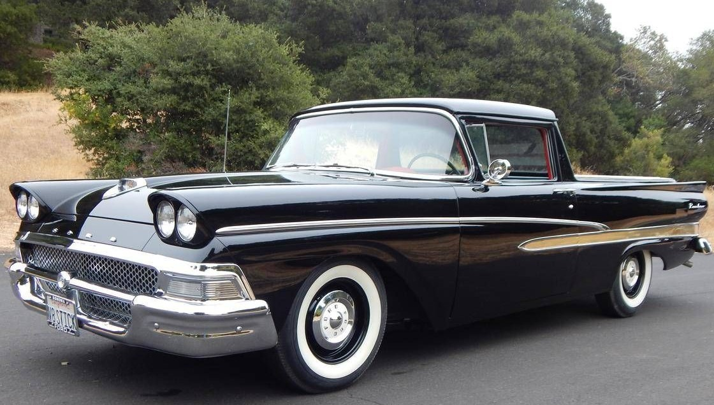
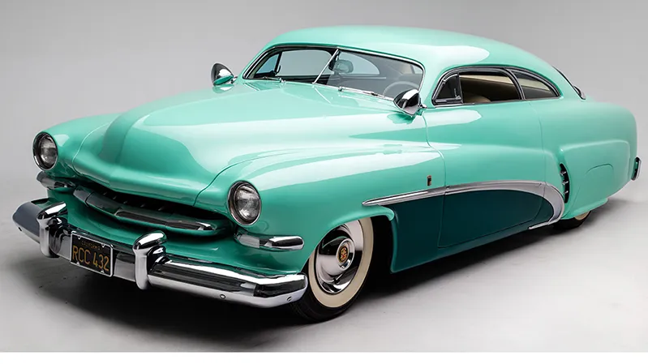
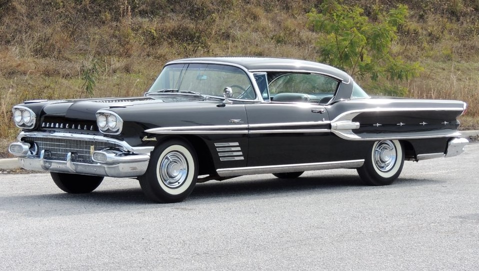
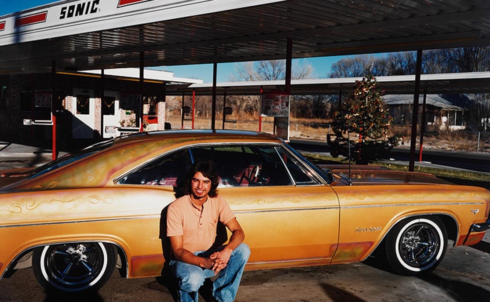
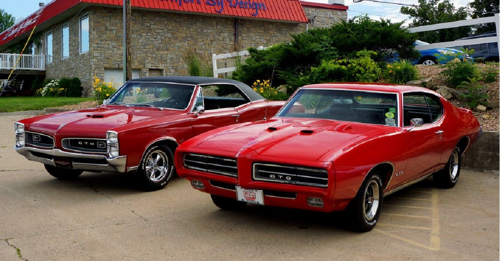
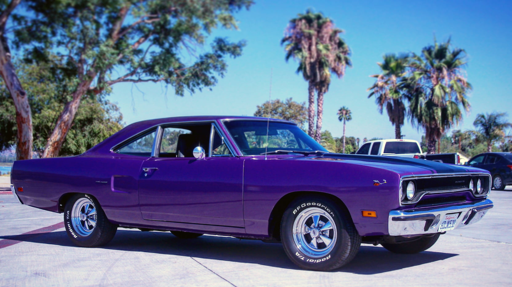

 

<STRONG>The Story</STRONG>

I grew up around car shows since an infant as my parents owned mainly Fords and Lincolns.&nbsp; In that time I grew to love certain cars, Corvettes first pulled me away from Fords, and then the love of the '55 Nomad.

The original idea for Jaws was from when, as a kid walking around car shows, most of the cars started to look repetitive.&nbsp; I wanted to have a vehicle no one could guess, no markers, no trim -- even the most car-aficionado would wonder what drove past them.. but had a gnarly engine that makes a lot of power

When I was finally able to make this dream come true, I was 26, in the Marine Corps, on a budget, raising a young family.&nbsp; I'd love to have many cars, but I had to settle to combine all my loves into one.&nbsp; These are the cars I loved that made Jaws what she is today. 

 

 

<STRONG>1958 Ford Ranchero</STRONG>

  

There is always one car that starts it all... this was my Father's "Hot Rod" when I was a toddler.&nbsp; This is where I learned about stepping on the gas and taking a car to its limits, having a car is for the fun and love of driving, and glass packs of a loud exhaust make a heart race.&nbsp; My father put in many custom switches, most I no longer remember what they did, though I remember the ones that flipped off the tail and brake lights in case Police ever chased him due to speeding.&nbsp;&nbsp; Sadly, it was sold to pay for the hospital bills for my younger sister.&nbsp; Though my father would never own a hot rodded car again, it stoked in my heart the need for an engine that goes.&nbsp; My car needed the largest engine available, and it was needed to&nbsp;

 

<STRONG>1940s Custom Hot Rods of the 80s.</STRONG>

Panel trucks, loved the themed panel trucks that were fun as a kid to find as many of the hiding animals, skulls, etc hidden around the vehicle. 49 Mercs with Corvette grills, where my all time favorite rod... again, big, heavy, low tot he ground... and the lowest and widest windows. The paint jobs, the flames/scallops, the hand pinstriping... the outrageous colors.&nbsp;&nbsp; The idea that they didn't care about resale value or if anyone else liked their vehicle.&nbsp; It was built for them and no one else.&nbsp; A nice thumb to the "numbers-matching" crowd.&nbsp; The idea to shave the chrome, paint the bumpers, the theme for kids to enjoy, and of course a custom color of sea foam green.

<STRONG>1958-59 Vehicles</STRONG>

My favorite years.&nbsp; Big.&nbsp; Wide.&nbsp; Heavy.&nbsp; Low to the ground.&nbsp; Rocket ship looks. These weren't made to be the fastest cars, but did these things have momentum.&nbsp; I knew Jaws needed to have that same width and low to the ground stance.&nbsp; A heavy car that just demanded to be seen.&nbsp; It turned out the 1968 Pontiac Catalina had that wide heavy look, yet somehow still full of power.   

 

<STRONG>Mexican Lowriders</STRONG>

The paint jobs... This is where I fell in love with paint jobs.&nbsp; Huge metal flake (Jaws almost had it if it wasn't so difficult to paint).&nbsp; The Themes again throughout the car, but in a completely different tone.&nbsp; Making the car a work of art.&nbsp; And of course, lowering the car til it scraped the ground, especially in the 80s when hydraulics like today just weren't as prevalent.

I cut my springs poor man style, but really in homage of these works of art... maybe someday I'll have enough guts to airbrush some art on Jaws.

 

<STRONG>60s Muscle Cars</STRONG>

The cars that simply looked like power.&nbsp; My favorite the GTO, but also a lover of all MOPAR of the mid to late 60s.&nbsp; Here are the engines, and the stances that just don't mess around.&nbsp; I loved as a kid looking in these engine compartments and seeing all the engines they had to offer, and all the stories of guys taking a simple crate engine and building it for speed.

Then of course, Dukes of Hazard was my favorite show as a kid, who couldn't love the General Lee and all the jumps and racing around?

